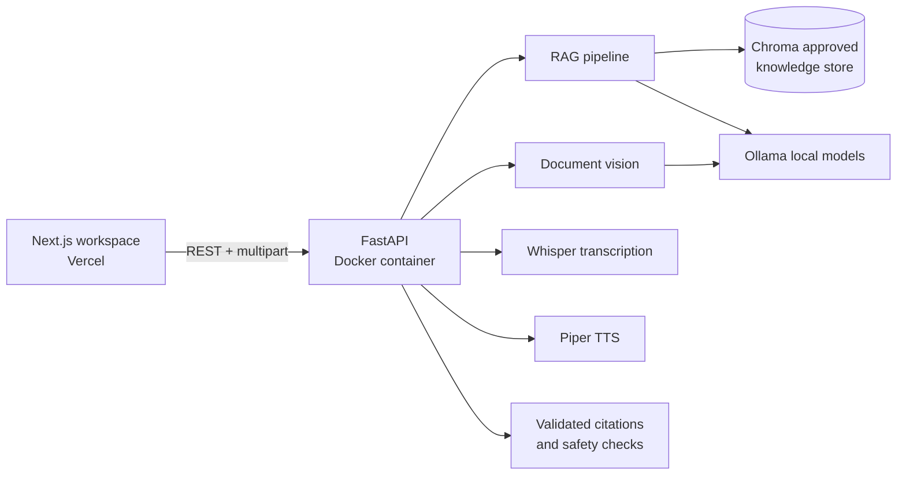

# MediGuide AI

**MediGuide AI — Health Document Intelligence**

A health document intelligence system that converts uploaded lab reports into structured, traceable longitudinal timelines and understandable educational explanations while preserving source evidence.

Document AI · OCR/Vision · structured extraction · normalization · human-in-the-loop verification · longitudinal data · RAG · provenance · responsible AI

The current product has a FastAPI backend and a Next.js frontend. Local Ollama, Chroma, Whisper, vision, and Piper remain optional supporting services — upload, native PDF extraction, verification, timeline, and provenance continue when AI providers are unavailable.

## Architecture



## Product surface

- Local open-source language model
- Premium landing page and unified AI workspace
- FastAPI endpoints for chat, documents, voice, translation, and TTS
- Next.js frontend ready for Vercel
- Conversation history
- Emergency phrase detection
- Medical scope restrictions
- Response validation

## Important Limitation

This project is an educational prototype. It does not diagnose,
prescribe medication, interpret medical images clinically, or replace
a qualified healthcare professional.

## Run locally

```powershell
python -m venv .venv
.venv\Scripts\Activate.ps1
pip install -r requirements.txt
ollama pull gemma3:4b
uvicorn api:app --reload --port 8000

# In another terminal
cd frontend
copy .env.example .env.local
npm install
npm run dev
```

The frontend runs at `http://localhost:3000` and the API docs at `http://localhost:8000/docs`. The original Gradio experience remains available with `python app.py`.

## Deploy

### Backend on Render (recommended for Health Document Intelligence)

Flagship path on Render does **not** require Ollama: upload → PyMuPDF native text → structured labs → verification → lab timeline.

1. Push this repository to GitHub.
2. Render → **New** → **Web Service** → select `MediGuide-AI` (do not change any other project).
3. Use one of these configurations:

**Option A — Docker (uses `Dockerfile.render`)**

| Field | Value |
|---|---|
| Root Directory | *(leave empty)* |
| Runtime | Docker |
| Dockerfile Path | `Dockerfile.render` |
| Health Check Path | `/api/health` |

**Option B — Native Python**

| Field | Value |
|---|---|
| Root Directory | *(leave empty)* |
| Runtime | Python 3 |
| Build Command | `pip install -r requirements-render.txt` |
| Start Command | `uvicorn api:app --host 0.0.0.0 --port $PORT` |
| Health Check Path | `/api/health` |

**Environment variables**

| Key | Value |
|---|---|
| `FRONTEND_ORIGINS` | `https://mediguide-ai-woad.vercel.app,http://localhost:3000,http://127.0.0.1:3000` |
| `DATABASE_URL` | `sqlite:///data/mediguide.db` |
| `DOC_INTEL_TEMP_DIR` | `/tmp/mediguide_docs` |

4. After deploy, open `https://YOUR-SERVICE.onrender.com/api/health`. You should see `"service": "mediguide-api"` with `"document_processing": "available"` even when `"ollama": "unavailable"`.

### Connect Vercel after health is green

In Vercel → MediGuide project → Settings → Environment Variables:

| Key | Value |
|---|---|
| `NEXT_PUBLIC_API_URL` | `https://YOUR-SERVICE.onrender.com` |

No `/api`, no `/docs`, no trailing slash. Then **Redeploy** the frontend.

### Backend Docker (local / full AI stack)

```powershell
docker build -t mediguide-api -f Dockerfile.render .
docker run -p 8000:8000 mediguide-api
```

For the full local AI stack (Ollama, Whisper, Piper), use `Dockerfile` + `requirements.txt` and set `OLLAMA_HOST`.

### Frontend on Vercel

Import the `frontend` directory as the Vercel project root and set `NEXT_PUBLIC_API_URL` to the HTTPS URL of the Render FastAPI service. Build command: `npm run build`.

### Frontend on Cloudflare Workers

Set `NEXT_PUBLIC_API_URL` to the HTTPS URL of the separately deployed FastAPI backend before running `npm --prefix frontend run cloudflare:deploy`. The frontend cannot use `localhost:8000` from a public Worker; that address refers to each visitor's own computer.

## API endpoints

- `GET /api/health`
- `POST /api/chat`
- `POST /api/transcribe` with multipart audio
- `POST /api/documents/analyze` with multipart image/PDF-compatible document input
- `POST /api/translate`
- `POST /api/speak`

## Phase 3 features

- Local medical-document image upload
- Medication-label extraction
- Lab-report text extraction
- Structured JSON output
- Editable extracted information
- Mandatory user confirmation
- Image-file validation
- Vision-scope safety checks
- Local Ollama vision model
- Automated image tests

## Vision limitations

This feature is limited to educational document assistance.
It does not clinically interpret X-rays, CT scans, MRI scans,
ultrasound images, pathology slides, wounds, skin lesions, or
other diagnostic medical images.
