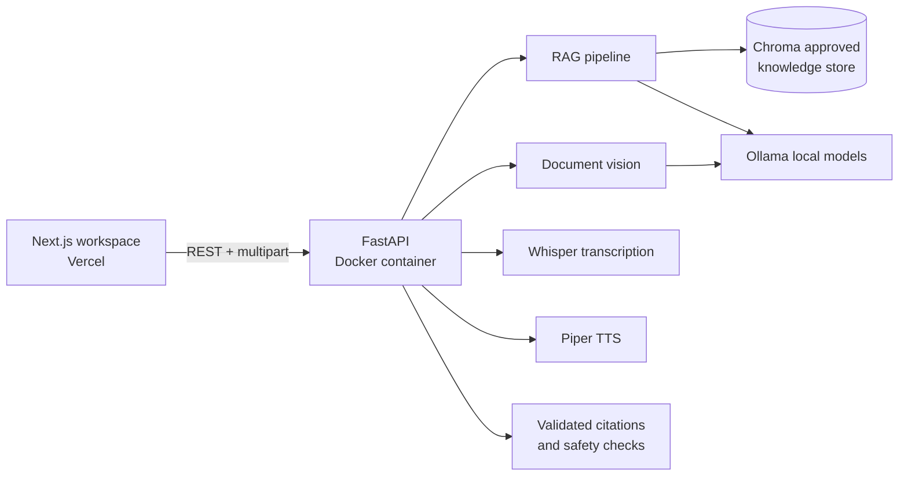

# MediGuide AI

MediGuide AI is a local, multimodal health-education and appointment-preparation assistant. The current product has a FastAPI backend and a Next.js + Tailwind frontend, while preserving the existing local Ollama, Chroma, Whisper, vision, and Piper services.

## Architecture



## Product surface

- Local open-source language model
- Premium landing page and unified AI workspace
- FastAPI endpoints for chat, documents, voice, translation, and TTS
- Next.js frontend ready for Vercel
- Conversation history
- Emergency phrase detection
- Medical scope restrictions
- Response validation

## Important Limitation

This project is an educational prototype. It does not diagnose,
prescribe medication, interpret medical images clinically, or replace
a qualified healthcare professional.

## Run locally

```powershell
python -m venv .venv
.venv\Scripts\Activate.ps1
pip install -r requirements.txt
ollama pull gemma3:4b
uvicorn api:app --reload --port 8000

# In another terminal
cd frontend
copy .env.example .env.local
npm install
npm run dev
```

The frontend runs at `http://localhost:3000` and the API docs at `http://localhost:8000/docs`. The original Gradio experience remains available with `python app.py`.

## Deploy

### Backend

Build and run the API container in an environment with access to the configured Ollama host and the approved knowledge store:

```powershell
docker build -t mediguide-api .
docker run --env-file .env -p 8000:8000 mediguide-api
```

For a remote deployment, set `OLLAMA_HOST`, model names, and the vector-store configuration in the backend environment. Keep the API behind HTTPS and restrict `allow_origins` in `api.py` to the deployed frontend origin.

### Frontend on Vercel

Import the `frontend` directory as the Vercel project root and set `NEXT_PUBLIC_API_URL` to the HTTPS URL of the separately deployed backend. Build command: `npm run build`.

## API endpoints

- `GET /api/health`
- `POST /api/chat`
- `POST /api/transcribe` with multipart audio
- `POST /api/documents/analyze` with multipart image/PDF-compatible document input
- `POST /api/translate`
- `POST /api/speak`

## Phase 3 features

- Local medical-document image upload
- Medication-label extraction
- Lab-report text extraction
- Structured JSON output
- Editable extracted information
- Mandatory user confirmation
- Image-file validation
- Vision-scope safety checks
- Local Ollama vision model
- Automated image tests

## Vision limitations

This feature is limited to educational document assistance.
It does not clinically interpret X-rays, CT scans, MRI scans,
ultrasound images, pathology slides, wounds, skin lesions, or
other diagnostic medical images.
